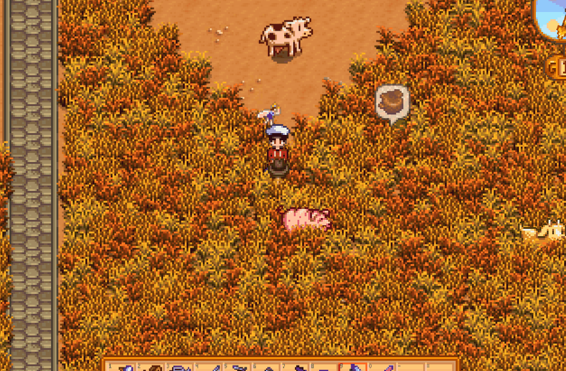

# TruffleBubbles
**TruffleBubbles** is a [Stardew Valley](https://stardewvalley.net) mod which displays bubble indicators to help you
locate truffles that spawned in tall grasses.

## Demo

## Install
1. Install the latest version of [SMAPI](https://smapi.io).
2. Download this mod from the [release page](https://github.com/tastytypist/TruffleBubbles/releases).
3. Extract and place its contents in the game's `Mods` directory.
4. Run the game using SMAPI.

## Attributions
This project is licensed under the GPLv3 License.
